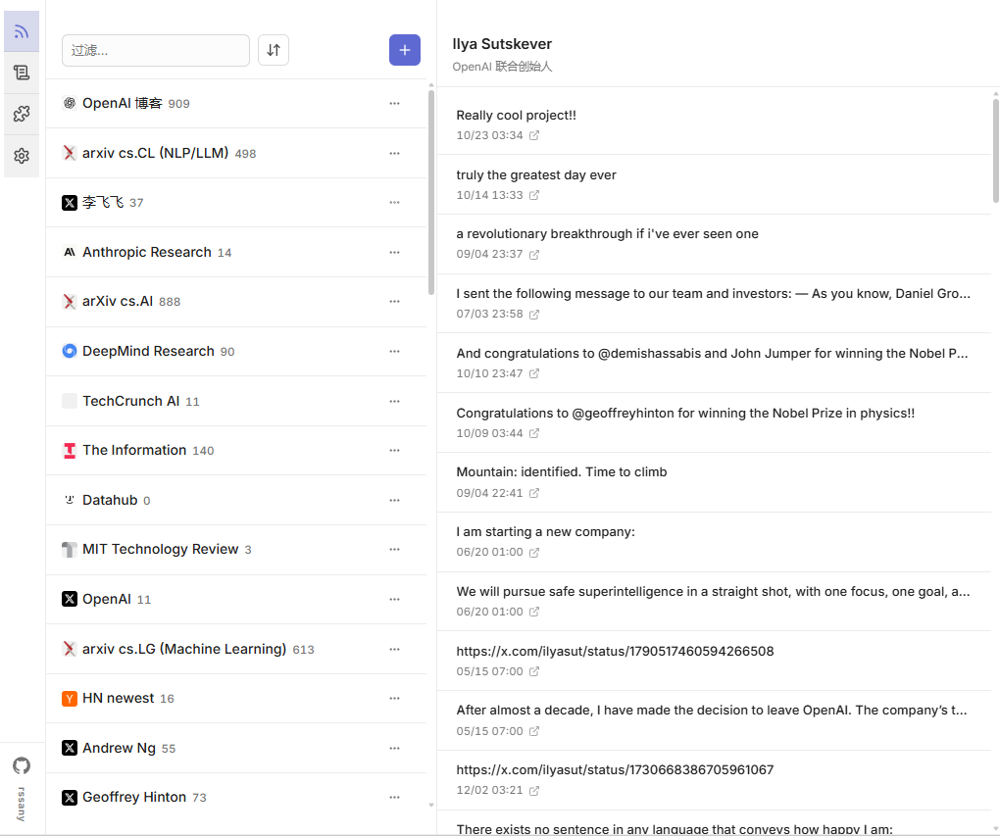

# RSSAny - 把任何信息变成RSS订阅


> 按信源抓取网页 / RSS / 邮件等，解析、补全文、打标签与翻译后**入库**，再按需生成 **RSS / Atom / JSON Feed** 与 JSON API。

**RSSAny** 是一套自托管的订阅管线：列表 URL → **抓取与解析**（规则 / LLM）→ **正文提取**（自定义 / Readability / LLM）→ **upsert 去重** → 固定 **pipeline**（打标签、翻译等）→ 对外提供 `**/rss`** 等输出。

## 界面预览



---

## 功能概览

- **统一订阅**：在 `.rssany/sources.json` 中配置网站列表、标准 RSS、IMAP 邮件等，由调度器按 `refresh` 策略拉取。
- **可插拔信源**：**Site / Source** 插件（`.rssany.js` / `.rssany.ts`），见 **[插件配置说明](./docs/plugins.md)**。
- **正文与解析**：在信源 `fetchItems`（及需要的 `ctx.extractItem` 等）内完成；入库后跑 pipeline。
- **固定 pipeline**：`app/pipeline/` 中打标签、翻译等，由 `.rssany/config.json` 的 `pipeline.steps` 开关（**不是**用户目录下的 pipeline 插件）。
- **LLM 辅助**：解析、提取、标签、翻译等可按配置走 OpenAI 兼容接口。
- **站点登录**：需登录的站点通过 Puppeteer 管理 Cookie（与产品用户账号无关）。
- **可选远端投递**：若 `config.json` 中 `**deliver.url`** 非空，在写库与 pipeline 完成后将条目以 `**{ sourceRef, items }**` JSON **POST** 到该 URL（由 `app/deliver/post.ts` 发送）；留空则仅本地消费。
- **Web 界面**：SvelteKit 构建产物由后端托管；**Feeds** 等需 **邮箱校验**；`**/admin`** 需 `**users.role === 'admin'**`（可从 `**/me**` 进入）。

---

## 技术栈（摘要）


| 层级  | 说明                                                           |
| --- | ------------------------------------------------------------ |
| 运行时 | Node.js **20–23**（见 `package.json` `engines`）                |
| 后端  | Hono、`tsx` 开发入口                                              |
| 数据  | **SQLite**（`better-sqlite3`），默认 **`~/.rssany/data/rssany.db`**（Windows：`%USERPROFILE%\.rssany\data\rssany.db`） |
| 前端  | `webui/`（SvelteKit + Vite，构建输出由根服务托管）                        |


原生模块 `**better-sqlite3**` 安装时会编译；若遇绑定缺失，请确认未禁用构建（仓库 `pnpm-workspace.yaml` 中已允许其 `allowBuilds`）。

---

## 快速开始

日常使用只需 **Node.js 20.x–23.x**（与 `package.json` 的 `engines` 一致）：

### 全局安装（推荐）

```bash
npm install -g rssany   # 与 npm i -g rssany 相同
rssany
```

安装包内已包含构建好的后端与 Web 界面；启动后用浏览器打开终端里提示的地址（默认 **`http://127.0.0.1:18473/`**，端口可在**运行命令时当前目录**下的 `.env` 里设置 `PORT`）。

- **数据目录**：首次运行会在 **`~/.rssany/`**（Windows：`%USERPROFILE%\.rssany\`）自动从包内 **`init/`** 生成 `sources.json`、`config.json` 等（已存在则不会覆盖）。
- **可选配置**：在启动 `rssany` 时的**当前目录**放置 `.env`（可参考仓库里的 `.env.example`），用于 JWT、OAuth、SMTP、LLM（如 `OPENAI_API_KEY` / `OPENAI_BASE_URL` / `OPENAI_MODEL`）等。
- **重置全部本地数据**（结束占用 `PORT` 的进程并删除用户目录，慎用）：执行 **`rssany reset`**；在含 `.env` 的目录下运行可读取 `PORT` / `RSSANY_USER_DIR`，或事先在环境里导出这些变量。

等价于在项目里执行 `node node_modules/rssany/dist/index.js`；CLI 名为 **`rssany`**。

### 从源码运行（开发 / 贡献）

需要 **pnpm**：

```bash
pnpm install
pnpm run webui:install
cp .env.example .env   # 按需修改
```

**开发**（后端托管 `webui` 构建目录；改前端可 watch）：

```bash
pnpm run dev:all
```

或分步：`pnpm run webui:build` 后 `pnpm dev`。

**仅调试 WebUI 热更新**（可选）：`cd webui && pnpm dev`（Vite 代理到本机后端，见 `webui/vite.config.ts`）。

**生产**（本仓库）：`pnpm run webui:build && pnpm start`。

**重置本地数据**（与全局安装的 `rssany reset` 逻辑相同）：`pnpm reset`。

发布到 npm 时 `prepublishOnly` 会执行 `build:all`（后端 `vite build` + `webui:build`）。

---

## 数据流（简图）

```
sources.json / 信源插件
  → 调度器触发 fetchItems
  → upsertItems
  → pipeline（每条一次）
  → [可选] deliver.url POST（出站，非入站 API）
```

消费侧：**RSS/XML**、`**/api/*`**、Web UI。

---

## 常用 HTTP 能力

### RSS 输出

- **按条件从库中生成**：支持 `search`、`tags`、`lng`、`limit` 等查询参数；可用 `subscribed=1` 限定为 `sources.json` 中出现的 ref。
- **按 URL 即时抓取**：`GET /rss/https://example.com/...`（具体行为以路由实现为准）。

---

## 配置

**信源插件（Site / Source）**：目录约定、`listUrlPattern` / `pattern`、`fetchItems`、与 `sources.json` 的关系等，见 **[docs/plugins.md](./docs/plugins.md)**。

### Pipeline（固定代码）

`**app/pipeline/**`，通过 `**.rssany/config.json**` 配置步骤，例如：

```json
{
  "pipeline": {
    "steps": [
      { "id": "tagger", "enabled": true },
      { "id": "translator", "enabled": false }
    ]
  },
  "deliver": {
    "url": ""
  }
}
```

`deliver.url` 非空时会对处理完成的条目向该 URL 发起出站 POST；留空则不投递。

### `sources.json` 片段示例

```json
{
  "sources": [
    { "ref": "https://example.com/feed.xml", "label": "Example", "refresh": "1h" }
  ]
}
```

合法 `refresh` 取值包括：`10min`、`30min`、`1h`、`6h`、`12h`、`1day`（默认）、`3day`、`7day`。

---

## 仓库目录（摘要）

```
├── app/                 # 后端：路由、feeder、scraper、pipeline、db、auth…
│   └── plugins/builtin/ # 内置信源 *.rssany.js
├── docs/                # 用户文档（如 plugins.md）
└── webui/               # SvelteKit 前端

~/.rssany/               # 运行时用户数据（首次启动创建；或 RSSANY_USER_DIR）
    ├── sources.json
    ├── config.json
    ├── tags.json
    ├── data/rssany.db   # SQLite 主库
    ├── cache/
    └── plugins/         # 用户插件覆盖内置
```

更细的模块说明见 **[AGENTS.md](./AGENTS.md)**（与代码迭代同步，若有出入以代码为准）。

---

## 许可证

MIT